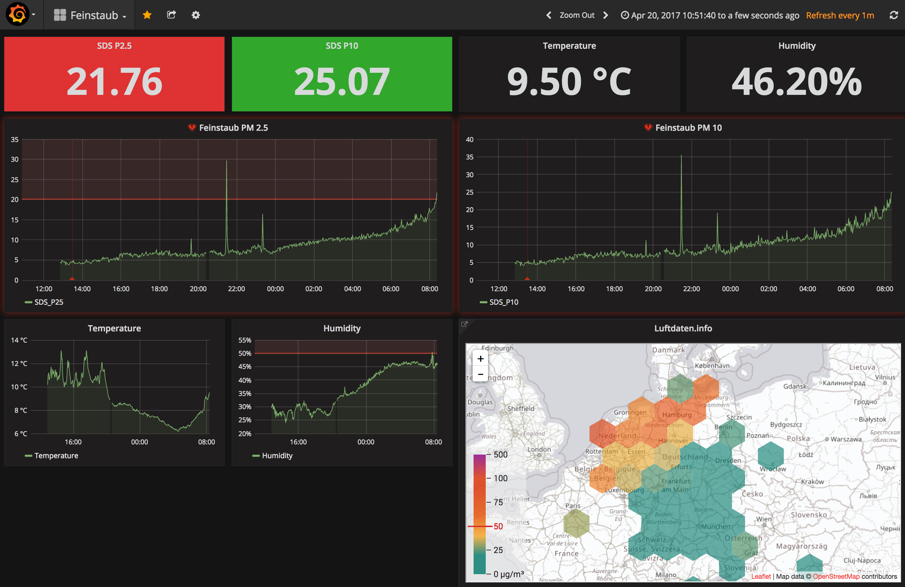

# Bodos Raspberry PI

This is the configuration for my Raspberry PI.

# List of things that get installed

* [Ruby](http:/www.ruby-lang.org) 
* [Grafana](http://grafana.org/) 
* [InfluxDB](https://docs.influxdata.com/influxdb)
* [vim](http://www.vim.org/)
* [htop](http://hisham.hm/htop/)
* [borg backup](https://borgbackup.readthedocs.io/)

You can configure the version for the packages
in the [config.yml](config_example.yml) file.
If there is non, the latest official raspbian package
is used.

This also activates unattended upgrades, the Raspberry
will automatically update packages, but will not
restart. You might want to do that manually for
kernel patches.

# How to use it

Steps to install it on your machine:

* Basic setup on the Raspberry Pi:
  * Install [NOOBS](https://github.com/procount/noobsconfig/) on the Raspberry
  * Select the non ui version of raspbian
  * Wait till it is installed and login using `pi` and `raspberry` as password
  * Activate ssh as described [here](https://www.raspberrypi.org/documentation/remote-access/ssh/README.md).
  * Add your ssh key to the `.ssh/authorized_keys` file on the Raspberry
* Setup and run [ansible](http://ansible.com) on your computer to install everything on the Raspberry:
  * Copy the `config.yml_example` to `config.yml` and configure the values in there
  * Change the IP in the [`hosts`](hosts) file to the IP of your Raspberry
  * Install ansible with `brew install ansible`
  * `sh run.sh` (this will take a bit of time, especially the ruby build)
  * Now you have [InfluxDB](https://docs.influxdata.com/influxdb),
    [Grafana](http://grafana.org/) and
    [Ruby](http:/www.ruby-lang.org) installed on the Raspberry.
  * Open `http://[raspberryip]:3000` to see the Grafana interface and go through the
    wizard to configure the database connection (the InfluxDB password can be
    found in the `config.yml`)
  * if you enabled borg backup, make sure to add the ~/.ssh/id_rsa.pub to the
    authorized_keys file on the backup target server

And now you need some data for your InfluxDB to make it
worth it. For example you could build a small air pollution sensor for around
30€ to generate the charts above. Details can be found [here](http://luftdaten.info/).
